# 🎥 Video Streaming Application - Architecture & Deep Dive

Welcome to the documentation for our Video Streaming Application! This guide is designed for beginners to understand **exactly** how we built a scalable, YouTube-like video upload and streaming pipeline.

We didn't just upload a file to a folder; we built a system that handles **transcoding**, **adaptive streaming**, **queues**, and **cloud storage**.

---

## 🏗️ High-Level Architecture

We use a **High-Performance Direct-to-Storage** architecture. Instead of the server acting as a middleman for large video files, the browser communicates directly with Cloudflare R2 for uploads, while the server coordinates the process and handles background transcoding.

```mermaid
sequenceDiagram
    autonumber
    participant User as 👤 User
    participant Client as 💻 Frontend (React)
    participant Server as 🚀 Backend (NestJS)
    participant R2 as ☁️ Cloudflare R2
    participant Queue as 📨 BullMQ/Redis
    participant Worker as ⚙️ Processor (Worker)

    Note over User, R2: Phase 1: Resumable Upload
    User->>Client: Selects Video
    Client->>Client: Generate File Fingerprint
    Client->>Server: POST /videos/init-upload
    Server->>R2: CreateMultipartUpload
    Server-->>Client: uploadId & videoId

    loop Each 10MB Chunk
        Client->>Server: GET /videos/upload-url
        Server-->>Client: Signed PUT URL
        Client->>R2: PUT chunk (Direct Upload)
    end

    Client->>Server: POST /videos/complete-upload
    Server->>R2: CompleteMultipartUpload
    Server->>Queue: Add Job { isUrl: true }
    Server-->>Client: Status: PROCESSING

    Note over Queue, Worker: Phase 2: Background Transcoding
    Queue->>Worker: Pick up job
    Worker->>R2: Download original MP4
    Worker->>Worker: FFmpeg: Transcode to HLS (3 Qualities)
    Worker->>R2: Upload HLS Segments (.ts) & Playlists
    Worker->>R2: Delete original MP4
    Worker-->>Server: Emit Progress via SSE

    Note over Client, R2: Phase 3: Streaming Playback
    Worker->>Server: Update DB: READY
    Server-->>Client: SSE: "Ready to Play"
    User->>Client: Clicks Watch
    Client->>R2: Stream HLS via HLS.js
```



---

## 🛠️ The Tech Stack (What & Why?)

| Component      | Technology               | Why we used it?                                                                           |
| -------------- | ------------------------ | ----------------------------------------------------------------------------------------- |
| **Frontend**   | React + Vite             | Fast, responsive UI.                                                                      |
| **Backend**    | NestJS                   | Robust, scalable Node.js framework. Great for structured code.                            |
| **Database**   | PostgreSQL + Prisma      | Reliable SQL database with an amazing ORM (Prisma) for type-safety.                       |
| **Queue**      | BullMQ + Redis           | Handles heavy background tasks (video processing) without freezing the main server.       |
| **Processing** | FFmpeg                   | The "Swiss Army Knife" of video and audio processing. Converts formats.                   |
| **Storage**    | Cloudflare R2            | S3-compatible object storage. Cheaper than AWS S3 and has zero egress fees!               |
| **Playback**   | HLS.js                   | Allows browsers to play HLS streams (which native HTML5 video tags often can't do alone). |
| **Status**     | SSE (Server-Sent Events) | Real-time connection to show the user "Processing 45%..." without refreshing.             |

---

## 🔍 Detailed Step-by-Step Breakdown

### 1️⃣ The "Direct" Upload (Client → R2)

**The Problem:** Large files (2GB+) fail easily and waste server bandwidth if the server acts as a proxy.
**The Solution:** Direct-to-R2 Resumable Uploads.

-   **Fingerprinting**: We identify files by name, size, and date. If you refresh, the app remembers where you left off.
-   **Signed URLs**: The server gives the browser a temporary "Security Pass" (Signed URL) to upload chunks directly to Cloudflare.
-   **Multipart Upload**: Files are sent in 10MB chunks. If one fails, only that chunk is re-sent.

### 2️⃣ The "Fire and Forget" (Queueing)

**The Problem:** Transcoding a video takes minutes.
**The Solution:** Asynchronous Processing via BullMQ.

-   **Backend**: Once R2 confirms all chunks are in, we trigger a background job.
-   **Response**: We immediately tell the user: _"Upload Complete! We are processing your video."_

### 3️⃣ Real-Time Feedback (SSE)

**The Problem:** Users hate waiting without knowing what's happening.
**The Solution:** Server-Sent Events (SSE).

-   **Progress Tracking**: As FFmpeg works, it tells the database its current percentage.
-   **SSE Stream**: The frontend listens to a persistent stream. Any change in the DB or internal events is "pushed" to the user instantly.

### 4️⃣ The Heavy Lifting (FFmpeg & HLS)

-   **Worker (`video.processor.ts`)**: The background process downloads the original MP4 from R2.
-   **FFmpeg**: It splits the video into hundreds of tiny segments versioned for 360p, 720p, and 1080p.
-   **Adaptive Bitrate**: This allows the video player to automatically drop to 360p if your internet slows down, preventing buffering.

### 5️⃣ Cleanup & Security

-   **Storage Optimization**: Once HLS transcoding is finished and uploaded back to R2, we **delete the original MP4** to save storage costs.
-   **CORS**: We've configured R2 to only allow uploads from specific frontend domains.

---

## 🚀 How to Run It

1. **Start Services** (Postgres & Redis):
    ```bash
    docker compose up -d postgres redis
    ```
2. **Setup Env**:
   Add `R2_ACCESS_KEY_ID`, `R2_SECRET_ACCESS_KEY`, `R2_S3_API`, and `R2_BUCKET_NAME` to your server `.env`.
3. **Database Setup**:
    ```bash
    cd server
    npx prisma migrate dev
    npx prisma generate
    ```
4. **Run Everything**:
    - **Server**: `npm run start:dev` (in `server` folder)
    - **Client**: `npm run dev` (in `client` folder)

Happy Streaming! 🍿
